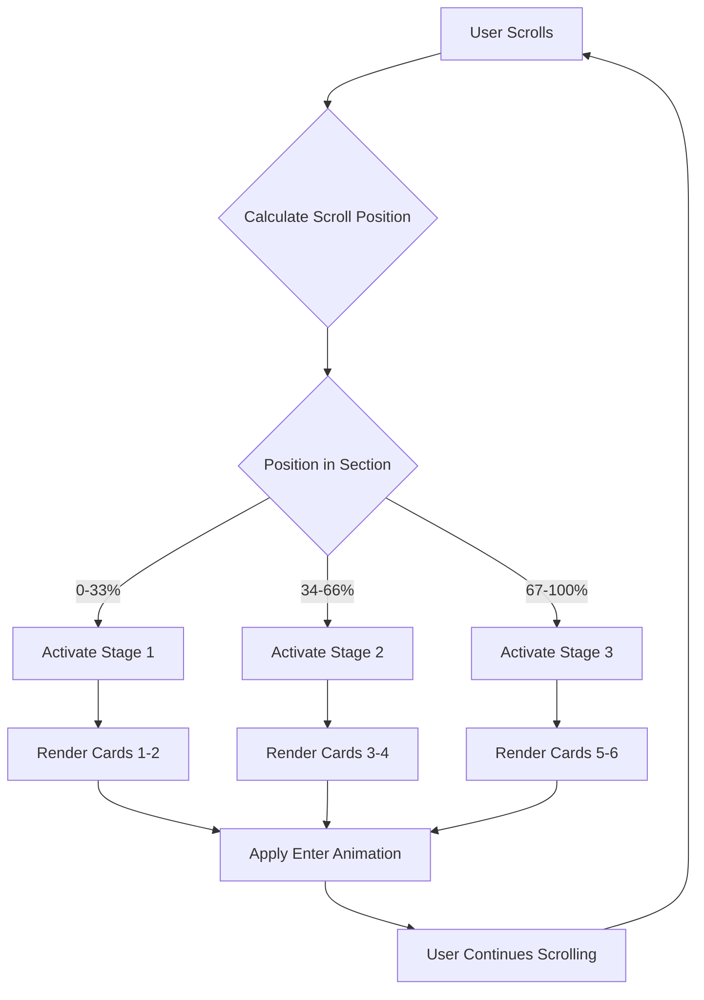

# Redesign Practice Section

## Overview

Redesign the "Everything You Need for Serious Practice" section (FeaturesSection component) on the landing page by merging the structural patterns from the provided inspiration code with the techno-spiritual design aesthetics of the TechnoSpiritualPricingCard component. The section must maintain the current background while achieving visual harmony with the "Invest in Your Evolution" pricing section.

## Design Goals

- Create cohesive visual language between the practice features section and pricing cards
- Apply techno-spiritual design elements (circuit patterns, corner brackets, sacred geometry)
- Enhance interactivity with sophisticated hover states and micro-animations
- Preserve existing background gradient patterns
- Maintain readability and spiritual aesthetic balance

## Section Structure

### Header Block

The section header remains centered with improved typographic hierarchy:

**Title Treatment**
- Primary heading: "Everything You Need for Serious Practice"
- Typography: Large serif font (3xl to 6xl responsive scale)
- Color scheme: Gradient text from amber-100 through purple-100 to amber-100
- Visual enhancement: Subtle drop shadow with amber glow effect
- Font weight: Extra-light with "Serious Practice" emphasized in semibold

**Decorative Elements**
- Top ornament: Sparkles icon in amber-400 with pulse animation
- Subtitle divider: Horizontal gradient lines flanking the tagline
- Tagline text: "All in one clean, powerful interface"
- Accent keywords: "CLEAN" in cyan-400 and "POWERFUL" in amber-400 (uppercase, bold, small text)

### Multi-Stage Scroll-Triggered Experience

The feature presentation is divided into three sequential stages that activate based on scroll position, eliminating the need for manual navigation clicks.

**Stage Progression System**
- Total stages: 3 distinct phases
- Activation: Scroll-triggered using intersection observers
- Navigation: Automatic progression as user scrolls down
- Stage indicator: Numeric badges (1, 2, 3) showing current active stage
- Visual feedback: Active stage highlighted, inactive stages dimmed

**Stage Indicators Design**
- Position: Top center of section (above or beside title)
- Style: Circular badges with numbers
- Active state: Larger size, amber-400 border, filled background
- Inactive state: Smaller size, slate-600 border, transparent background
- Transition: Smooth size and color changes (300ms duration)

**Stage Content Distribution**

Stage 1 - Foundation Tools (Cards 1-2):
- Progress Dashboard
- Sadhana To-Do

Stage 2 - Knowledge & Growth (Cards 3-4):
- Sacred Library
- Sankalpa Metrics

Stage 3 - Community & Guidance (Cards 5-6):
- Guru Tools
- Cohort Experience

**Scroll Trigger Behavior**

Each stage has its own trigger zone:
- Trigger zones: Divided vertically across section height
- Zone 1 threshold: 0-33% scroll progress through section
- Zone 2 threshold: 34-66% scroll progress through section
- Zone 3 threshold: 67-100% scroll progress through section
- Activation point: When zone enters viewport center
- Deactivation: Previous stage fades out, new stage fades in

**Inter-Stage Transitions**

When scrolling from one stage to another:
- Exit animation: Current cards fade out and scale down (400ms)
- Enter animation: New cards fade in and scale up (400ms)
- Stagger: 100ms delay between each card in new stage
- Smoothing: Ease-in-out timing function
- Direction: Cards can slide from side or emerge from center

### Feature Cards Grid

**Layout Configuration**
- Grid system: Responsive 1/2 column layout for 2 cards per stage (mobile 1 column, tablet/desktop 2 columns)
- Gap spacing: 6 units between cards
- Total cards: 6 feature cards (2 per stage × 3 stages)
- Visible at once: Only 2 cards (current stage) visible at any time
- Animation: Staggered entrance with 100ms delay between the 2 cards per stage
- Stage transition: Fade out/in with scale transformation between stages

**Card Content Structure**

Each feature card contains:

1. **Icon Container** (top section)
   - Circular icon holder with border
   - Icon size: 24px with 1.5px stroke width
   - Background: Layered with blur effect behind icon
   - Glow effect: Conditional based on hover state

2. **Text Content** (middle section)
   - Title: Large text (xl size), medium weight, wide tracking
   - Description: Smaller text (sm size), light font weight, relaxed line height
   - Color transitions on hover

3. **Decorative Elements** (overlay/borders)
   - Corner brackets (HUD-style) in all four corners
   - Tech grid background pattern (very subtle opacity)
   - Bottom decorative line with gradient
   - Sacred circuit pattern overlay (inspired by pricing cards)

### Features Data

| Icon | Title | Description |
|------|-------|-------------|
| BarChart2 | Progress Dashboard | Your streaks, mantra counts, reading minutes, vow integrity — all visible at a glance via the astral plane interface. |
| ListTodo | Sadhana To-Do | Your daily ritual automatically generated and checked off. Synchronize your digital actions with karmic intent. |
| Library | Sacred Library | Curated sadhanas, authentic scriptures, guided rituals — verified wisdom digitized for the modern seeker. |
| TrendingUp | Sankalpa Metrics | Earn XP, Karma Points, and Depth Index™ for true vow completion. Gamify your ascent to enlightenment. |
| UserCog | Guru Tools | Assign cards, monitor cohorts, track disciples — omniscient oversight from a single dharma dashboard. |
| Users | Cohort Experience | Join a sangha of serious practitioners. Keep each other accountable in the holographic web of consciousness. |

### Stage Navigation Indicators

**Numeric Badge System**
- Badges: Three circular indicators numbered 1, 2, 3
- Layout: Horizontal row, centered above main content
- Spacing: Gap of 4 units between badges
- Purpose: Show current active stage without manual click interaction

**Badge Visual Design**

Inactive Badge:
- Size: 10 units diameter (40px)
- Border: 1px solid slate-600
- Background: Transparent
- Number color: Slate-500
- Number size: Text-sm
- Opacity: 60%

Active Badge:
- Size: 12 units diameter (48px)
- Border: 2px solid amber-400
- Background: Amber-400/20 (semi-transparent fill)
- Number color: Amber-100
- Number size: Text-base (slightly larger)
- Opacity: 100%
- Glow: Subtle amber shadow (0 0 12px amber-400/30)

**Badge State Transitions**
- Duration: 300ms
- Properties animated: Size, border width, border color, background color, opacity, box shadow
- Timing function: Ease-in-out
- Visual effect: Smooth pulsing growth when becoming active

### Footer Call-to-Action

**Button Component**
- Label: "Begin Your Journey"
- Icon: Activity icon (16px)
- Style: Rounded full pill shape
- Background: Gradient from indigo-600 through purple-600
- Texture overlay: Stardust pattern at low opacity
- Border: Ring effect (2px white with opacity)
- Interactions: Scale transform on hover/active states
- Visibility: Always visible below all stages

## Visual Design Specifications

### Card Design System

**Default State**
- Background: Slate-900 with 40% opacity, backdrop blur applied
- Border: Slate-800 (1px solid)
- Border radius: 2xl (approximately 16px)
- Shadow: None
- Transform: None

**Hover State**
- Background: Slate-900 with 80% opacity, backdrop blur maintained
- Border: Amber-400 with 50% opacity
- Shadow: Large amber glow (0 0 30px with amber-400 at 15% opacity)
- Transform: Translate Y by -4px (lift effect)
- Transition duration: 500ms with ease-out timing

### Techno-Spiritual Design Elements

**Corner Brackets (HUD Style)**
- Position: All four corners (top-left, top-right, bottom-left, bottom-right)
- Size: 2x2 units (8px × 8px)
- Border width: 1px
- Default color: Slate-600
- Hover color: Amber-400
- Transition: Color change over 300ms
- Purpose: Create heads-up display aesthetic

**Tech Grid Pattern Background**
- Pattern type: Linear gradient grid (horizontal and vertical lines)
- Line color: Gray with 12% opacity (#80808012)
- Line spacing: 14px × 14px
- Opacity: 3% (very subtle)
- Layer: Absolute positioned overlay within card
- Purpose: Subtle technological texture

**Sacred Circuit Pattern Overlay**
- Pattern inspiration: Sacred geometry from TechnoSpiritualPricingCard
- Elements: Circuit lines forming geometric flower shapes
- Color: Uses card's accent color (amber-400 family)
- Opacity: 15% with multiply blend mode
- Pattern includes:
  - Vertical and horizontal circuit lines
  - Rotated square (45 degrees) forming diamond
  - Central circle dots
  - Connecting dots at cardinal points
  - Diagonal connecting lines

**Decorative Bottom Line**
- Type: Animated gradient line
- Gradient: From transparent through amber-500 (50% opacity) to transparent
- Height: 1px
- Width: Full card width
- Position: Absolute at bottom edge
- Animation: Slide in from left on hover (700ms duration)
- Initial state: Translated -100% X-axis, opacity 0
- Hover state: Translated 0% X-axis, opacity 100

### Icon Container Design

**Structure**
- Outer glow layer: Blur effect (medium intensity)
- Inner container: Circular (14 units / 56px diameter)
- Border: 1px solid
- Icon centering: Flexbox center alignment

**State Variations**

Default State:
- Container border: Slate-700
- Container background: Slate-800 with 50% opacity
- Icon color: Slate-400
- Glow: Opacity 0 (invisible)

Hover State:
- Container border: Amber-400 with 80% opacity
- Container background: Slate-900 (solid)
- Icon color: Amber-300
- Icon animation: Pulse effect
- Glow: Opacity 40%, amber-400 color

**Glow Effect Behavior**
- Blur radius: Medium (approximately 12px)
- Color transition: Cyan-400 (default hidden) to amber-400 (hover visible)
- Transition timing: 500ms
- Purpose: Create ethereal, spiritual energy effect

### Typography System

**Card Title**
- Font size: xl (20px)
- Font weight: Medium (500)
- Letter spacing: Wide (0.025em)
- Line height: Default
- Color default: Slate-200
- Color hover: Amber-100
- Transition: 300ms color change

**Card Description**
- Font size: sm (14px)
- Font weight: Light (300)
- Line height: Relaxed (1.625)
- Color: Slate-400 (no hover change)
- Purpose: Ensure readability without visual competition with title

**Section Heading**
- Font size range: 4xl to 6xl (responsive)
- Font weight: Extra-light (200) with semibold (600) emphasis
- Letter spacing: Tight (-0.025em)
- Text treatment: Transparent with gradient clip
- Gradient: Horizontal from amber-100 through purple-100 to amber-100
- Shadow: Drop shadow with amber glow (0 0 15px with amber-400 at 10% opacity)

**Section Tagline**
- Font size: lg (18px)
- Font weight: Light (300)
- Letter spacing: Wide (0.025em)
- Base color: Slate-400
- Accent keywords styling:
  - Font size: sm (14px)
  - Font weight: Bold (700)
  - Text transform: Uppercase
  - Letter spacing: Wider (0.05em)
  - "CLEAN" color: Cyan-400 with 80% opacity
  - "POWERFUL" color: Amber-400 with 80% opacity

### Color Palette Integration

**Primary Colors (from TechnoSpiritualPricingCard)**
- Saffron base: #FFB344
- Light orange panel: #FFCC80
- Deep maroon accent: #5C2218
- Bronze/gold highlight: #B45309
- Dark brown text: #4A1C12

**Secondary Colors (from inspiration code)**
- Amber-100: Very light amber for text
- Amber-300: Medium amber for icons
- Amber-400: Standard amber for borders and glows
- Amber-500: Deeper amber for gradients
- Slate-200 to Slate-900: Grayscale progression
- Cyan-400: Accent for "clean" keyword and alternate glow
- Purple-100: Gradient text component
- Indigo-600/Purple-600: CTA button gradient

**Application Strategy**
- Default borders and inactive states: Use slate tones
- Hover states and active elements: Use amber tones
- Text hierarchy: Amber for emphasis, slate for body
- Background overlays: Very low opacity amber gradients
- Sacred patterns: Maroon accent (#5C2218) or amber-400

### Animation and Interaction Patterns

**Stage Activation Animation**

When a new stage becomes active through scrolling:

Exit Animation (Previous Stage):
- Opacity: 100% to 0%
- Scale: 100% to 95%
- Transform Y: 0 to -20px (subtle upward shift)
- Duration: 400ms
- Timing: Ease-in
- Visibility: Set to hidden after animation completes

Enter Animation (New Stage):
- Initial state: Opacity 0%, scale 95%, transform Y +20px (below position)
- Final state: Opacity 100%, scale 100%, transform Y 0
- Duration: 400ms
- Timing: Ease-out
- Stagger: 100ms delay between the 2 cards
- Start delay: Begins after previous stage exit animation (sequential, not simultaneous)

**Card Individual Entrance** (within active stage)
- Animation name: Scale-in with fade and slide
- Initial state: Smaller scale (95%), lower opacity (0%), slightly below position (+20px Y)
- Final state: Full scale (100%), full opacity (100%), natural position (0 Y)
- Duration: 400ms
- Stagger pattern: 100ms delay between cards (Card 1 at 0ms, Card 2 at 100ms)
- Trigger: Stage becomes active via scroll detection

**Scroll Progress Tracking**
- Method: Intersection Observer API monitoring section scroll progress
- Calculation: Percentage of section scrolled through viewport
- Update frequency: Continuous during scroll
- Stage switching threshold: 33% intervals (0-33%, 34-66%, 67-100%)
- Debouncing: Prevent rapid stage switching with 150ms cooldown

**Hover Micro-Interactions**

Card Container:
- Translation: Upward movement (-4px on Y-axis)
- Border color transition: Slate-800 to amber-400/50
- Shadow expansion: None to large amber glow
- Background opacity: 40% to 80%
- Timing: 500ms ease-out for all properties

Icon Container:
- Border intensity increase
- Background solidification
- Icon color shift to amber-300
- Icon pulse animation activation
- Glow layer fade-in (0 to 40% opacity)
- Timing: 500ms synchronized with card hover

Decorative Line:
- Slide-in from left edge
- Transform: -100% to 0% X-translation
- Opacity: 0 to 100%
- Timing: 700ms (slightly longer for dramatic effect)

Corner Brackets:
- Color transition only
- Timing: 300ms (faster for responsive feel)

**Text Transitions**
- Title color: 300ms linear transition
- No transform or movement on text to maintain readability

**CTA Button Interactions**
- Hover: Scale up to 105%
- Active: Scale down to 95%
- Background opacity: 80% to 100%
- Ring opacity: 10% to 30%
- Icon presence: Activity icon for movement metaphor

### Background Preservation

**Current Background**
The section currently uses a tiled Yantra pattern:
- Pattern: SVG diamond shape with inscribed circle
- Pattern size: 60px × 60px tiles
- Color: #FFD54A (amber-yellow)
- Stroke width: 0.5px
- Opacity: 2% (0.02)
- Layer position: Absolute inset-0
- Z-index: Behind content (pointer-events: none)

**Preservation Strategy**
- Maintain exact SVG pattern definition
- Preserve opacity level for subtlety
- Keep absolute positioning and layering
- Ensure pattern remains visible under new card designs
- No modifications to pattern structure or colors

**Integration with New Design**
- New card backgrounds use backdrop-blur and semi-transparent slate colors
- This allows the yantra pattern to show through subtly
- Hover state increases card opacity but pattern remains visible at edges
- Circuit pattern overlay is distinct from background yantra pattern
- Multiple pattern layers create depth without visual conflict

### Spacing and Layout

**Section Padding**
- Vertical: 24 units (py-24, approximately 96px)
- Horizontal: 4 units (px-4, approximately 16px)
- Maximum width container: 1300px
- Container margin: Auto-centered

**Header Margin**
- Bottom margin: 16 units (mb-16, approximately 64px)
- Decorative sparkles top margin: 6 units (mb-6)
- Title bottom margin: 6 units (mb-6)

**Card Internal Padding**
- All sides: 8 units (p-8, approximately 32px)
- Provides breathing room for content and decorative elements

**Icon Container Spacing**
- Bottom margin: 6 units (mb-6, approximately 24px)
- Creates separation between icon and text content

**Text Spacing**
- Title bottom margin: 3 units (mb-3, approximately 12px)
- Description line height: Relaxed (1.625)

**CTA Footer**
- Top margin: 20 units (mt-20, approximately 80px)
- Alignment: Center

### Technical Implementation Considerations

**Component State Management**
- Active stage tracking: Single state variable holding current stage number (1, 2, or 3)
- Hover state tracking: Individual state per card using useState hook
- Mount state tracking: Component-level visibility state
- Scroll progress state: Percentage value representing scroll position within section
- Animation visibility: Scroll trigger integration using useScrollTrigger hook or Intersection Observer
- Stage transition lock: Boolean state preventing rapid stage changes during transitions

**Event Handlers**
- onMouseEnter: Set isHovered to true for individual card
- onMouseLeave: Set isHovered to false for individual card
- onScroll: Calculate section scroll progress percentage
- Intersection Observer callback: Update active stage based on scroll position
- Stage change handler: Trigger exit/enter animations and update active stage state
- All handlers trigger appropriate re-renders with style recalculation

**Performance Optimizations**
- Backdrop blur: Applied efficiently with CSS property
- Animations: Use transform and opacity (GPU-accelerated properties)
- Pattern overlays: Position absolute to avoid layout recalculation
- Scroll triggers: Debounced/throttled intersection observation

**Responsive Behavior**
- Grid columns: 1 (mobile), 2 (tablet/md), 3 (desktop/lg)
- Typography: Responsive font sizes using Tailwind breakpoint modifiers
- Padding: Maintains consistent spacing across breakpoints
- Icon sizes: Fixed to prevent CLS (Cumulative Layout Shift)

**Accessibility Considerations**
- Maintain focus states for keyboard navigation
- Ensure sufficient color contrast ratios (WCAG AA minimum)
- Provide hover alternatives for touch devices
- Semantic HTML structure preserved
- Icon decorative role considerations

## Scroll-Triggered Stage System Implementation

### Technical Architecture

**Scroll Detection Mechanism**

Option 1 - Intersection Observer (Recommended):
- Create multiple observer targets (invisible markers) at 33%, 66%, and 100% of section height
- Each marker triggers stage change when crossing viewport center
- Provides precise control over stage activation points
- Better performance than continuous scroll event listeners

Option 2 - Scroll Event with Progress Calculation:
- Listen to scroll events on window or section container
- Calculate section's position relative to viewport
- Compute scroll progress percentage within section bounds
- Map percentage to stage numbers (0-33% → Stage 1, 34-66% → Stage 2, 67-100% → Stage 3)

**State Flow Diagram**

**Conditional Rendering Logic**

The component renders different card sets based on active stage:

| Active Stage | Cards Rendered | Cards Hidden |
|--------------|----------------|-------------|
| 1 | Progress Dashboard, Sadhana To-Do | All others (4 cards) |
| 2 | Sacred Library, Sankalpa Metrics | All others (4 cards) |
| 3 | Guru Tools, Cohort Experience | All others (4 cards) |

**Animation Sequencing**

When transitioning from Stage X to Stage Y:

1. Detect scroll position change crossing threshold
2. Check if transition is not already in progress (lock check)
3. Set transition lock to true
4. Trigger exit animation on current stage cards
5. Wait for exit animation duration (400ms)
6. Update active stage state (X → Y)
7. Trigger enter animation on new stage cards with stagger
8. Wait for enter animation completion (400ms + stagger)
9. Release transition lock (set to false)
10. Ready for next potential transition

**Performance Optimization**
- Debounce scroll calculations: Maximum 1 calculation per 16ms (60fps)
- Use CSS transforms for animations (GPU-accelerated)
- Implement will-change property on transitioning elements
- Conditional rendering: Only mount visible stage cards in DOM
- Unmount hidden stages to reduce render overhead
- Use React.memo for card components to prevent unnecessary re-renders

## Integration Points

### Component Location
- File path: `src/components/landing/redesign/FeaturesSection.tsx`
- Parent component: HomePage
- Section position: Between WorkspaceSection and ExploreSection (or after SadhanaCardSection)
- Wrapper context: Inside wave gradient background wrapper div
- Minimum section height: Sufficient vertical space for 3 scroll stages (recommend minimum 200vh equivalent)

### Background Context
The section exists within a continuous wave gradient background applied from sections 2-8:
- Colors: Purple variations (#4b0753, #2a0a3e, #1a0b2e) transitioning to dark grays (#121212, #0a0a0a)
- Pattern: Recurring wave-like vertical gradient
- Purpose: Create unified visual flow across multiple sections
- Requirement: New design must work harmoniously with this existing background

### Dependencies
- Icons: lucide-react library (BarChart2, ListTodo, Library, TrendingUp, UserCog, Users, Sparkles, Activity)
- Hooks: 
  - useState: Manage active stage, hover states, transition lock
  - useEffect: Set up Intersection Observers, scroll event listeners, cleanup
  - useRef: Reference section container element, store observer instances
  - Custom useScrollTrigger: Optional for visibility detection
  - Custom useScrollProgress: Optional hook to calculate scroll percentage within section
- Browser APIs: Intersection Observer API for scroll-triggered stage changes
- Styling: Tailwind CSS utility classes with custom gradients and effects
- Animation libraries: Framer Motion (optional, for advanced orchestration), or pure CSS transitions
- Pattern inspiration: TechnoSpiritualPricingCard component in same directory

## Success Criteria

The redesigned section will be considered successful when:

1. **Visual Cohesion**: Feature cards visually match the techno-spiritual aesthetic of pricing cards (circuit patterns, corner brackets, sacred geometry elements)

2. **Background Preservation**: Original yantra pattern background remains visible and unchanged

3. **Scroll-Triggered Navigation**: Stages automatically activate based on scroll position without requiring manual clicks on next buttons or stage numbers

4. **Stage Indicator Clarity**: Numeric badges clearly show current active stage with distinct visual states for active/inactive

5. **Smooth Transitions**: Stage-to-stage transitions are fluid with proper exit/enter animations and no jarring content shifts

6. **Content Progressive Disclosure**: Users discover features progressively as they scroll, maintaining engagement throughout the section

7. **Interaction Quality**: Hover states on cards are smooth, responsive, and create engaging micro-interactions without performance degradation

8. **Responsive Design**: Layout gracefully adapts across mobile, tablet, and desktop viewports with appropriate stage trigger zones

9. **Accessibility**: Scroll-triggered stages work for keyboard users, with fallback mechanisms for users with reduced motion preferences

10. **Animation Performance**: All stage transitions, entrance animations, and hover effects run smoothly at 60fps

11. **Brand Consistency**: Typography, color palette, and spiritual terminology align with existing SadhanaBoard design language

12. **Content Clarity**: All six features remain clearly readable across all three stages with improved visual hierarchy

13. **Technical Integration**: Component integrates seamlessly with existing scroll detection systems and animation frameworks

14. **User Engagement**: Progressive feature revelation through scroll maintains user interest and encourages exploration

15. **No Manual Navigation Required**: Users experience natural content flow without needing to click next/previous buttons or stage numbers
